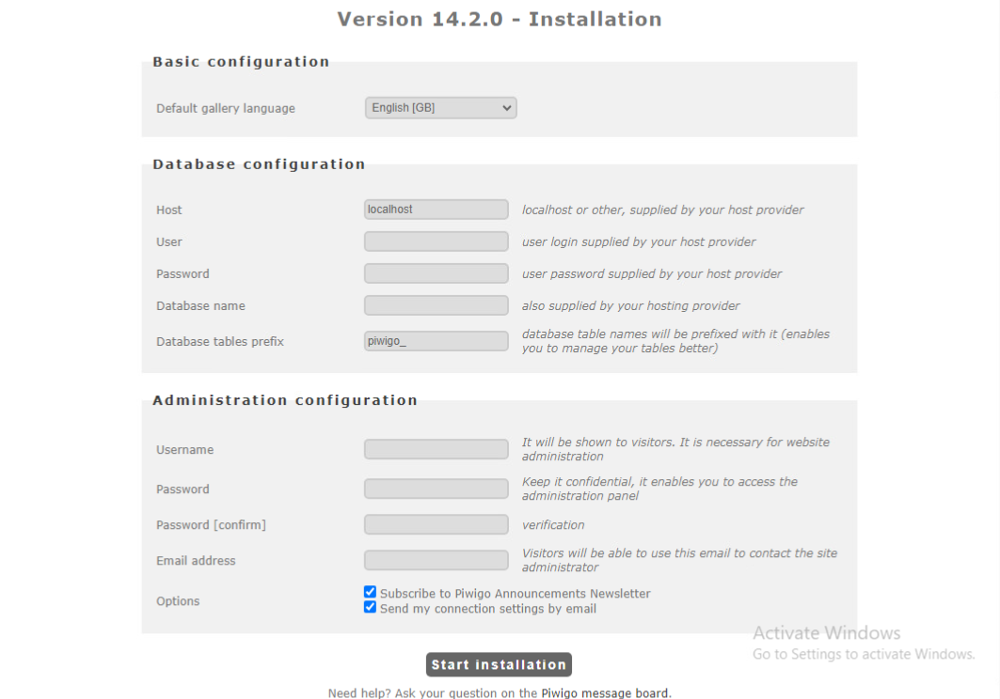

# Docker Compose Piwigo & MariaDB
This is build documentation for Piwigo and MariaDB using docker compose.

The following images will be used:
 * [Piwigo](https://docs.linuxserver.io/images/docker-piwigo/)
 * [MariaDB](https://docs.linuxserver.io/images/docker-mariadb/)

## Getting started
Before starting this project we need to decide where data is stored. For the sake of testing, make a directory in the home directory. Take note of the file path, it will be used in future configuration.
```
mkdir /home/<user>/piwigo
```

Make a `.yml` file. This will be used as the docker compose config. 
```
touch docker-compose.yml
```

[piwigo-compose.yml](https://github.com/deivnziegler/SYS-265-Docker-Build-Documentation/blob/main/piwigo-compose.yml)

```
services:
  mariadb:
    image: lscr.io/linuxserver/mariadb:latest
    container_name: mariadb
    environment:
    ...
services:
  piwigo:
    image: lscr.io/linuxserver/piwigo:latest
    container_name: piwigo
    environment:
    ...
```

## Config Edits

Use comments in the file to set your specifications if not using the defaults. The following must be changed in order to be deployed: 
```
volumes:
  - /home/user/piwigo/dbconfig:/config
```
Piwigo we will need a gallary directory as well as a config directory
```
volumes:
  - /home/user/piwigo/pconfig:/config
  - /home/user/piwigo/gallery:/gallery
```

 ## Deploying containers
```
$ docker compose up -d
[+] Running 2/2
   Container mariadb  Started
   Container piwigo   Started
```

## Expected Result
Execute the following command
```
docker ps
```
Two containers should be running, `mariadb` & `piwigo`
Make sure firewall rules are enabled to access the web portal for a different host using the following URL:
```
http://<docker_hostname>:80
```
The Web Portal should look like this:



